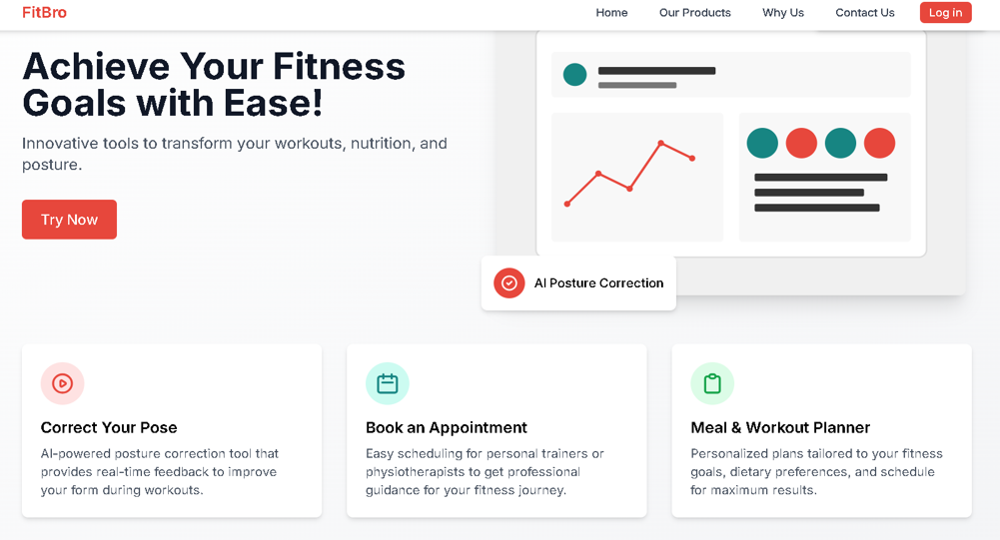
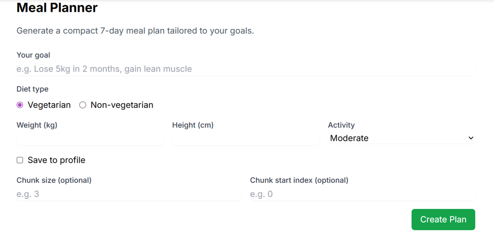
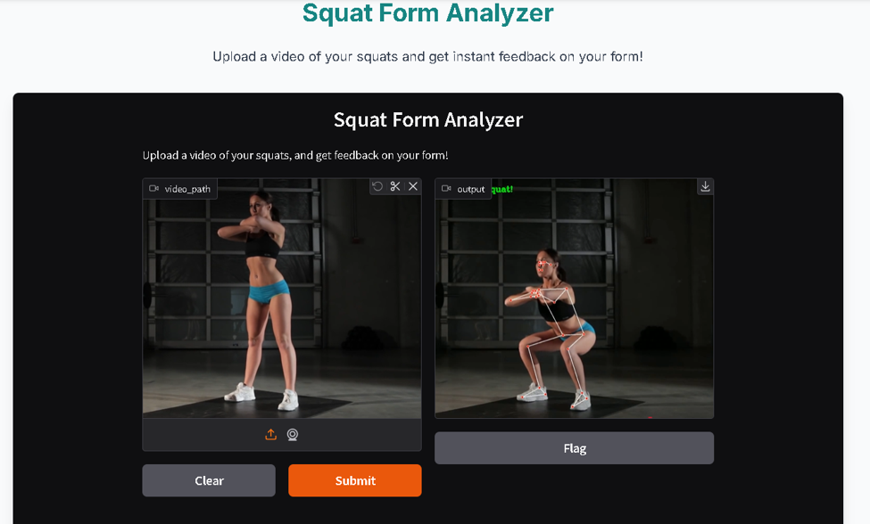
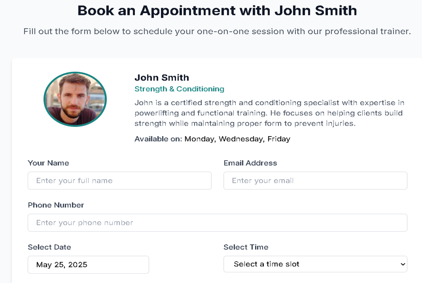
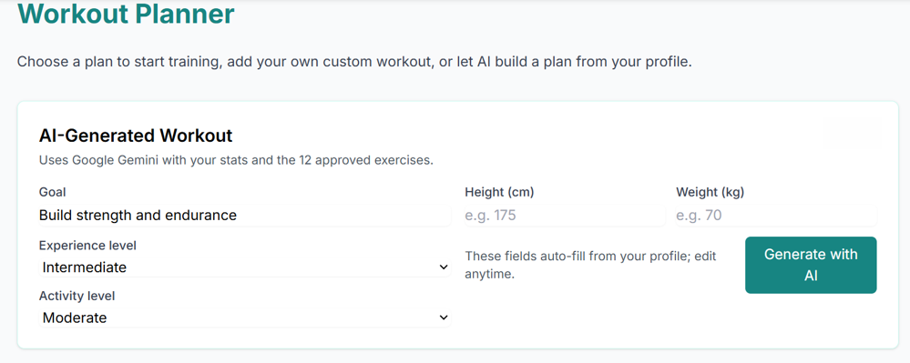

# FitBro — Final Year Major Project

A full-stack fitness application demonstrating workout sessions, trainer booking, generative meal planning, video coaching, and pose analysis modules. Built as a final-year major project featuring a complete frontend and backend architecture.

## 1. Project Overview

FitBro delivers a polished set of features for fitness sessions and coaching: a React + Vite frontend, an Express backend with Mongoose models, a meal-planner API powered by Google Generative models (when configured), ZEGO-based video sessions, and a collection of pose-analysis notebooks implementing Mediapipe workflows.

## 2. Features

- User authentication integrated via Clerk
- Trainer discovery UI and trainer listing pages
- Trainer booking and session management workflows
- Real-time video coaching sessions using ZEGO Cloud
- Meal-plan generation endpoint (Google Generative API integration; local fallback available)
- Backend API endpoints for trainers, bookings and meal plans (`/api/trainers`, `/api/bookings`, `/api/meal-plan`)
- Pose-analysis modules provided as Jupyter/Colab notebooks

## 3. Technologies Used

- Frontend: React, Vite, Tailwind CSS, React Router
- Backend: Node.js, Express, Mongoose (MongoDB)
- AI: Google Generative Models (Gemini) integration (backend)
- Video: ZEGO Cloud UI Kit
- Auth: Clerk
- Notebooks: Mediapipe, OpenCV, Gradio (Python)

## 4. System Architecture

- Frontend (React): UI, client-side routing, and API clients (`project/src/`)
- Backend (Express): REST endpoints, Mongoose models, meal-plan generation (`project/server/server.js`)
- Database (MongoDB): persistence for trainers, bookings, and meal plans
- AI Services: Google Generative API called by backend for meal-plan generation
- Pose Analysis: Standalone Jupyter/Colab notebooks located at `project/Pose Analyzers/` that can be run independently and optionally served via Gradio deployments

## 5. Project Structure

```
FitBro/
├─ project/
│  ├─ src/                   # React frontend (components, pages, services)
│  ├─ server/                # Express backend (server.js, models)
│  ├─ "Pose Analyzers"/     # Jupyter/Colab notebooks for pose analysis
│  └─ package.json
├─ README.md
```

## 6. Installation and Setup

Prerequisites: Node.js (v18+), npm, and a MongoDB instance (Atlas or local).

1. Clone the repository

```bash
git clone <repository-url>
cd FitBro
```

2. Frontend setup

```bash
cd project
npm install
npm run dev
# Open http://localhost:5173
```

3. Backend setup

```bash
cd project/server
npm install
npm start
# Server listens on http://localhost:5000 by default
```

Note: Example environment variables are provided in `.env.example` files. Copy those templates into local `.env` files and fill values before running.

## 7. Environment Variables

- Backend (`project/server/.env`):
  - `PORT` (optional)
  - `MONGODB_URI` — MongoDB connection string
  - `GENERATIVE_API_KEY` — Google Generative API key (optional; enables backend meal-plan generation)

- Frontend (`project/.env` or Vite env):
  - `VITE_CLERK_PUBLISHABLE_KEY` — Clerk publishable key
  - `VITE_ZEGO_APP_ID` — ZEGO App ID (numeric)

Refer to `.env.example` in the repository for formats and placeholders.

## 8. Pose Analysis Modules

Pose-analysis code lives in `project/Pose Analyzers/` as Jupyter/Colab notebooks. Each notebook implements a specific exercise analyzer (squats, bench press, lunges, etc.) using Mediapipe and OpenCV, and includes optional Gradio demo cells for interactive exploration.

How to use:

1. Open the desired notebook in Jupyter or Google Colab.
2. Install Python dependencies (create a venv and install packages listed in the notebook or create a `requirements.txt`).
3. Run cells to process video or webcam input; Gradio demo cells can be used for quick interactive demos.

## 9. Screenshots (placeholders)

Add screenshots or animated GIFs to `project/src/assets/screenshots/` and replace the placeholders below.







## 10. Future Enhancements

- Enhance video session management and security
- Persist booking flow end-to-end with front-end integration to backend booking endpoints
- Provide a `requirements.txt` for each notebook and a consolidated demo deployment (Hugging Face / Gradio)
- Add automated tests and CI workflows

## 11. Contributors

- FitBro Development Team

---

If you need any implementation details or want a brief walkthrough of specific modules (API routes, meal-plan generator, or notebooks), open an issue or contact the maintainers.